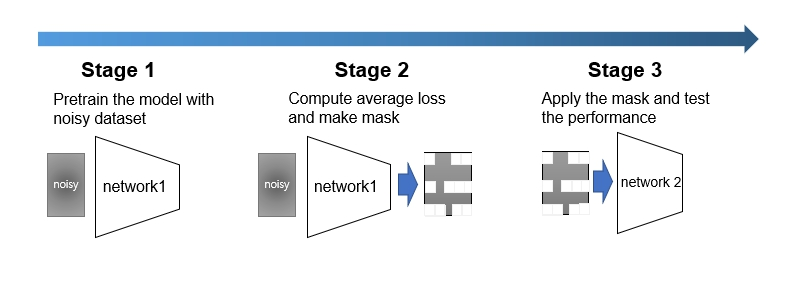
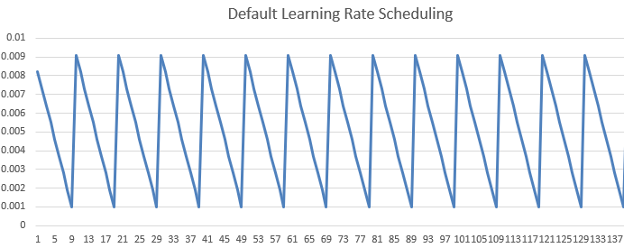

### Noisy Label Detection Implementation
O2U-Net + some modifications

O2U-Net implementation source git: [link](https://github.com/hjimce/O2U-Net)

<p align="center">
  
</p>

<p align="center">
  
</p>
     
#### Usage Example
```shell
python main.py  --network=resnet50  --noise_rate 0.6 --remove_rate 0.8

(test)
python main.py  --network=resnet50 --noise_rate 0.6 --remove_rate 0.85 --n_epoch1 1 --n_epoch2 2 --n_epoch3 2
```

<br/>

---
#### My Logs

2022/05
1. Remove Caffe2 thread-pool leak warning: [link](https://github.com/pytorch/pytorch/commit/567e6d3a8766133f384eb1e00635b21ed638d187)
2. *10 epoch experiment result*

epoch:10 lr:0.009100 train_loss: 3.1395677614974975 test_accuarcy:55.330000 noise_accuracy:0.840500 top 0.1 noise accuracy:0.982200

3. model: ResNet50, ResNet101
4. python main.py  --network=resnet101 --transforms=true (network: resnet50 / resnet101)

2022/06
1. first stage, second stage: *main.py*
2. third stage: *curriculum.py* : apply curriculum learning with masked dataset
3. mod save directory
4. Usage: python main.py  --network=resnet50  --noise_rate 0.6 --remove_rate 0.8
5. Add readme flow.jpg image
